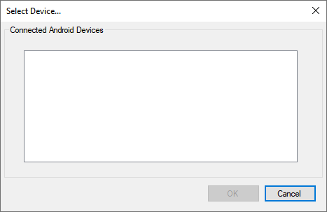
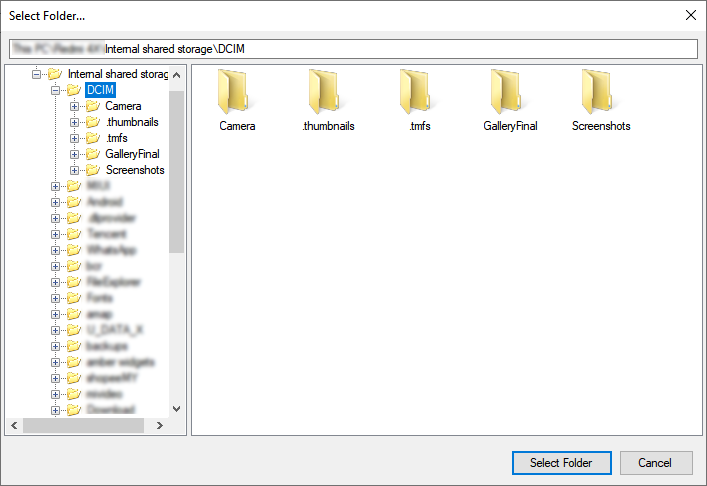
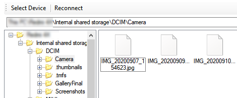

# MediaDevices.Control

## Introduction
MediaDevices.Control is a Windows Form Control for MediaDevices to interact with MTP (Media Transport Protocol) and PTP (Picture Transport Protocol) devices like cell phones.

***NOTE:*** *These package is only tested with Android Device.*

## Download
- [Nuget](https://www.nuget.org/packages/MediaDevices.Controls/)

## Features
### Media Device Select Dialog
WinForms Dialog to select connected device by it's description.


**Usage:**
```CSharp            
using (MediaDeviceSelectDialog dlg = new MediaDeviceSelectDialog())
{
   if (dlg.ShowDialog() == DialogResult.OK)
   {
      string device = dlg.SelectedDevice;
   }
}
```

### Media Device Folder Browser
WinForms Dialog to select folder on a connected MTP / PTP device.
***NOTE:*** *The connected device must enable PTP or MTP in order for Windows to access it's files and folders.*


**Usage:**
```CSharp
using (MediaDeviceFolderBrowseDialog dialog = new MediaDeviceFolderBrowseDialog("My Phone"))
{
    dialog.InitialDirectory = "\\Folder\\Startup";
    if(dialog.ShowDialog() == DialogResult.OK)
    {
        string SelectedFolder = dialog.SelectedFolder;
    }
}
```

### Media Device File Browser
User control to browse files and folder on selected device.
Just drag and drop to your application to use.

